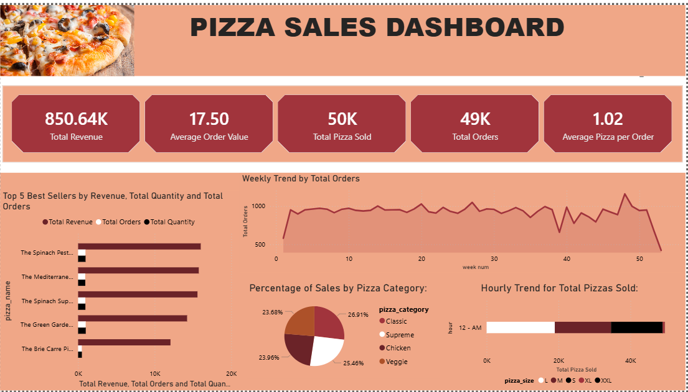
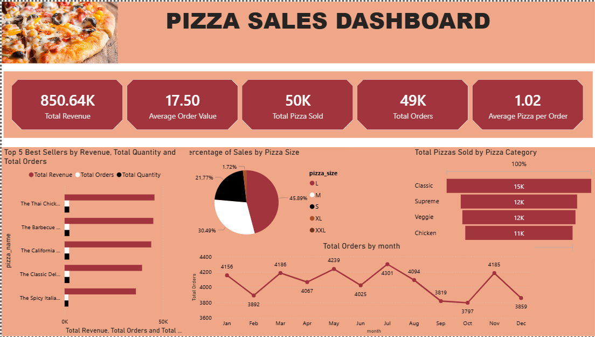

# Pizza-Sales-Dashboard
🍕 Pizza Sales Dashboard
A dynamic Power BI dashboard designed to analyze and visualize key performance indicators (KPIs) for a pizza restaurant's sales data. This project transforms raw transactional data into actionable business insights to monitor sales performance, optimize inventory, and identify customer preferences.

## 📈 Executive KPIs
Total Revenue: $850.64K

Total Orders: 49K

Total Pizzas Sold: 50K

Average Order Value: $17.50

Average Pizzas per Order: 1.02

## 📊 Key Insights & Features
Sales Performance Tracking: Real-time visibility into high-level metrics including revenue, volume, and transaction averages.

Granular Trend Analysis:

Weekly & Monthly Trends: Tracks order volume fluctuations over weeks and months (identifying peaks like July with 4,301 orders).

Hourly Trends: Identifies peak sales hours and distributions throughout the day.

## Product Performance Analytics:

Top Best Sellers: Evaluates top-performing items (e.g., The Thai Chicken Pizza, The Barbecue Chicken Pizza, The Spinach Pesto Pizza) by revenue, quantity, and total orders.

Inventory & Category Breakdowns:

Sales by Pizza Category: Analyzes volume distribution across Classic (26.91%), Supreme (25.46%), Chicken (23.96%), and Veggie (23.68%).

Sales by Pizza Size: Pinpoints customer preferences across sizes, highlighting Large (L) as the dominant driver at 45.89% of sales.

## 🛠️ Tech Stack
Business Intelligence: Power BI Desktop

Data Transformation: Power Query

Formulas & Metrics: DAX (Data Analysis Expressions) for dynamic measures

## 📁 Files in this Repository
Pizza_Sales_Dashboard.pbix — The main Power BI dashboard file (Download and open in Power BI Desktop to interact with the report).

